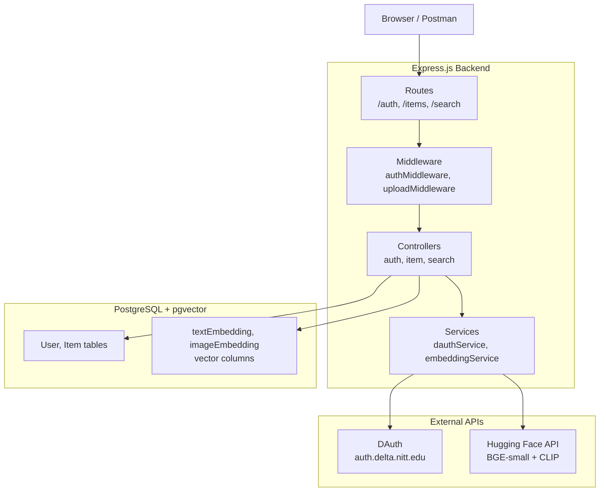

# Campus Lost & Found System — Walkthrough

## What Was Built

A complete Node.js backend for a campus lost & found system with AI-powered similarity matching. **20 files** created across 7 steps.

---

## Architecture Overview



---

## Files Created

### Step 1 — Project Scaffold
| File | Purpose |
|------|---------|
| [package.json](file:///home/anshul/Documents/GitHub/tc-backend/package.json) | Dependencies: express, prisma, multer, axios, cors, express-session |
| [.env.example](file:///home/anshul/Documents/GitHub/tc-backend/.env.example) | Template for all environment variables |
| [.gitignore](file:///home/anshul/Documents/GitHub/tc-backend/.gitignore) | Ignores node_modules, .env, uploads |
| [schema.prisma](file:///home/anshul/Documents/GitHub/tc-backend/prisma/schema.prisma) | User + Item models, Status enum, pgvector extension |
| [db.js](file:///home/anshul/Documents/GitHub/tc-backend/src/config/db.js) | Prisma client singleton |
| [server.js](file:///home/anshul/Documents/GitHub/tc-backend/src/server.js) | HTTP server entry point |

### Step 2 — DAuth Authentication
| File | Purpose |
|------|---------|
| [dauthService.js](file:///home/anshul/Documents/GitHub/tc-backend/src/services/dauthService.js) | 3 functions: `getAuthorizationUrl`, `exchangeCodeForToken`, `getUserProfile` |
| [authMiddleware.js](file:///home/anshul/Documents/GitHub/tc-backend/src/middleware/authMiddleware.js) | Checks `req.session.user`, returns 401 if missing |
| [authController.js](file:///home/anshul/Documents/GitHub/tc-backend/src/controllers/authController.js) | login → callback → upsert user → session |
| [authRoutes.js](file:///home/anshul/Documents/GitHub/tc-backend/src/routes/authRoutes.js) | `/auth/login`, `/auth/callback`, `/auth/logout`, `/auth/me` |

### Step 3 — Lost & Found CRUD
| File | Purpose |
|------|---------|
| [uploadMiddleware.js](file:///home/anshul/Documents/GitHub/tc-backend/src/middleware/uploadMiddleware.js) | Multer: disk storage, image-only filter, 5MB limit, max 5 files |
| [itemController.js](file:///home/anshul/Documents/GitHub/tc-backend/src/controllers/itemController.js) | create, getAll, getById, update, delete, markAsClaimed + ownership checks |
| [itemRoutes.js](file:///home/anshul/Documents/GitHub/tc-backend/src/routes/itemRoutes.js) | RESTful routes, GET public, mutations protected |

### Step 4 — Embedding Service
| File | Purpose |
|------|---------|
| [embeddingService.js](file:///home/anshul/Documents/GitHub/tc-backend/src/services/embeddingService.js) | `getTextEmbedding` (384d), `getImageEmbedding` (512d), `generateAndStoreEmbeddings` |

### Step 5 — Similarity Search
| File | Purpose |
|------|---------|
| [vectors.js](file:///home/anshul/Documents/GitHub/tc-backend/src/prisma/vectors.js) | Raw SQL with pgvector `<=>` operator for cosine similarity |
| [searchController.js](file:///home/anshul/Documents/GitHub/tc-backend/src/controllers/searchController.js) | `textSearch` and `imageSearch` handlers |
| [searchRoutes.js](file:///home/anshul/Documents/GitHub/tc-backend/src/routes/searchRoutes.js) | `POST /search/text` and `POST /search/image` |

### Step 6 — Docker
| File | Purpose |
|------|---------|
| [Dockerfile](file:///home/anshul/Documents/GitHub/tc-backend/Dockerfile) | Multi-stage build (deps → app) |
| [docker-compose.yml](file:///home/anshul/Documents/GitHub/tc-backend/docker-compose.yml) | `pgvector/pgvector:pg17` + Node.js app, healthcheck |
| [init.sql](file:///home/anshul/Documents/GitHub/tc-backend/init.sql) | `CREATE EXTENSION IF NOT EXISTS vector` |
| [add-vector-columns.sql](file:///home/anshul/Documents/GitHub/tc-backend/prisma/add-vector-columns.sql) | Adds vector(384) + vector(512) columns + IVFFlat indexes |

### Step 7 — Documentation
| File | Purpose |
|------|---------|
| [README.md](file:///home/anshul/Documents/GitHub/tc-backend/README.md) | Setup, DAuth config, pgvector explanation, all API endpoints with examples |
| [app.js](file:///home/anshul/Documents/GitHub/tc-backend/src/app.js) | Express app wiring all routes + global error handler |

---

## Verification

| Check | Result |
|-------|--------|
| `npm install` | ✅ 143 packages, 0 vulnerabilities |
| `npx prisma validate` | ✅ Schema is valid |
| All 15 JS files load | ✅ No import/syntax errors |
| Server starts on port 3000 | ✅ `/health` responds |

---

## How to Start

```bash
# Fill in your credentials
cp .env.example .env   # then edit .env

# Start everything
docker compose up

# Run migrations (in another terminal)
docker compose exec app npx prisma migrate dev --name init
docker compose exec db psql -U postgres -d lostandfound -c "$(cat prisma/add-vector-columns.sql)"

# Test health
curl http://localhost:3000/health
```

---

## Key Design Decisions

1. **No Passport.js** — DAuth has only 3 endpoints, manual OAuth2 with axios is simpler to understand
2. **express-session** — In-memory sessions for development (swap to Redis for production)
3. **Raw SQL for vectors** — Prisma lacks native pgvector support, so `vectors.js` uses `$queryRawUnsafe`
4. **Swappable embedding service** — Only `embeddingService.js` talks to Hugging Face; change one file to use local models
5. **Background embedding generation** — Embeddings are generated asynchronously after item creation so the API responds fast
